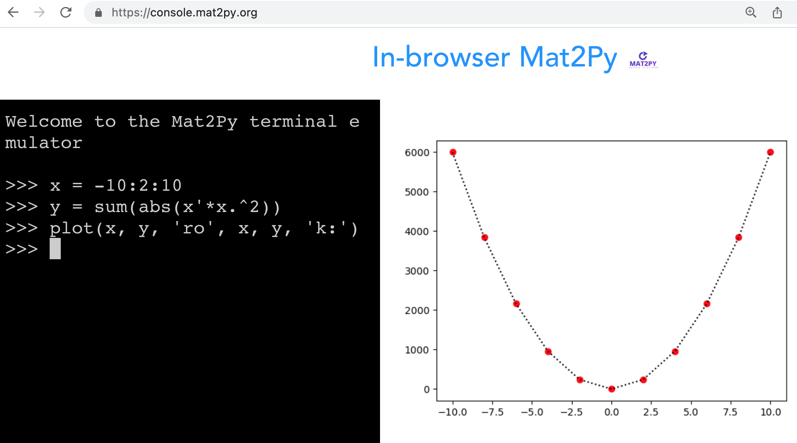

# mat2py

<div align="center">

[](https://github.com/mat2py/mat2py/actions?query=workflow%3Abuild)
[](https://pypi.org/project/mat2py/)
[](https://github.com/mat2py/mat2py/pulls?utf8=%E2%9C%93&q=is%3Apr%20author%3Aapp%2Fdependabot)

[](https://github.com/psf/black)
[](https://github.com/PyCQA/bandit)
[](https://github.com/mat2py/mat2py/blob/master/.pre-commit-config.yaml)
[](https://github.com/mat2py/mat2py/releases)
[](https://github.com/mat2py/mat2py/blob/master/LICENSE)


mat2py mean to be drop-in replacement of Matlab by wrapping Numpy/Scipy/... packages.

</div>

For instance usage, try the *Online Matlab Emulator* [here](https://console.mat2py.org/). 
Please note:
- Loading the environment may take quite long time, especially for the first time. Try refresh the page incase bad network connection.
- Do not support paste chunk of matlab code yet. Please input the code line by line.
- Do a feature request when encounter `NotImplementedError`.



The final goal is to create a **serverless**, **Matlab compatiable** console completely in end-users' browser.

## First Steps

### Installation

```bash
python3 -m pip install -U mat2py
```

or install with `Poetry`

```bash
poetry add mat2py
```

### Install the translator `mh_python` if needed
```bash
python3 -m pip install -U mh-python
```

### Try the example `demo_fft`

```bash
# download the one already converted and formatted
wget https://raw.githubusercontent.com/mat2py/mat2py/main/tests/test_example/demo_fft.py

# or convert it yourself
echo "wget https://raw.githubusercontent.com/mat2py/miss_hit/matlab2numpy/tests/mat2np/demo_fft.m"
echo "mh_python --python-alongside --format demo_fft.m"

# run it...
python3 demo_fft.py
```

You can also **try out** the [online translator](https://translate.mat2py.org/) by modifiy the example or put your own code.

## For Developer

### Initialize your code

1. Clone `mat2py`:

```bash
git clone https://github.com/mat2py/mat2py 
```

2. If you don't have `Poetry` installed run:

```bash
make poetry-download
source ~/.poetry/env
```

3. Initialize poetry and install `pre-commit` hooks:

```bash
make install
make pre-commit-install
```

4. Run the lint to check:

```bash
make lint
```

## ToDO

- A serverless web service for run `.m`/`.py` code inside browser
- Complete set of [MATLAB® Basic Functions](https://www.mathworks.com/content/dam/mathworks/fact-sheet/matlab-basic-functions-reference.pdf)
- Copy-on-Write beheviour
- A cleaner class hierarchy
- Enable `lint`(mypy, UT, etc.)

## 📈 Releases

You can see the list of available releases on the [GitHub Releases](https://github.com/mat2py/mat2py/releases) page.

We follow [Semantic Versions](https://semver.org/) specification.

We use [`Release Drafter`](https://github.com/marketplace/actions/release-drafter). As pull requests are merged, a draft release is kept up-to-date listing the changes, ready to publish when you’re ready. With the categories option, you can categorize pull requests in release notes using labels.

## 🛡 License

[](https://github.com/mat2py/mat2py/blob/master/LICENSE)

This project is licensed under the terms of the `MIT` license. See [LICENSE](https://github.com/mat2py/mat2py/blob/master/LICENSE) for more details.

## 📃 Citation

```bibtex
@misc{mat2py,
  author = {mat2py},
  title = {mat2py mean to be drop-in replacement of Matlab by wrapping Numpy/Scipy/... packages.},
  year = {2021},
  publisher = {GitHub},
  journal = {GitHub repository},
  howpublished = {\url{https://github.com/mat2py/mat2py}}
}
```

## Credits [](https://github.com/TezRomacH/python-package-template)

- This project was initially generated with [`python-package-template`](https://github.com/TezRomacH/python-package-template)
- The Matlab to Python translator `mh_python` is developed under fork of [MISS HIT](https://github.com/florianschanda/miss_hit), a fantastic Matlab static analysis tool.
- The [serverless console](https://console.mat2py.org/) is created based on [Pyodide](https://pyodide.org/).
